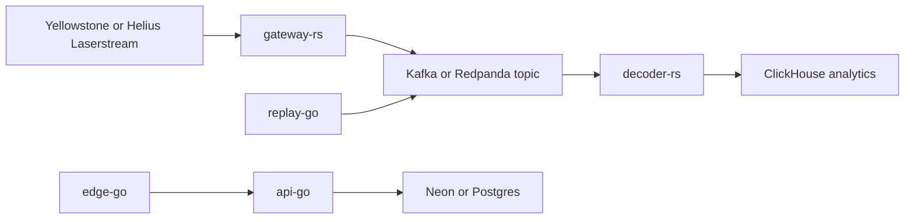

# Helios Architecture

## Service topology

Helios uses a microservices architecture with clear data-plane and control-plane boundaries.

## Request path

1. Clients call `edge-go`.
2. `edge-go` applies optional edge auth, selects backend (`round_robin` or `least_conn`), and proxies to healthy `api-go` replicas.
3. `api-go` enforces auth (API key and/or JWT), rate limiting (memory or Redis), and query validation.
4. `api-go` serves operational data from Postgres and metrics/OpenAPI through protected routes.

## Ingestion path

1. `gateway-rs` consumes Solana stream updates from Yellowstone/Laserstream.
2. Events are normalized into canonical envelopes and published to Kafka/Redpanda.
3. `decoder-rs` consumes envelopes, applies idempotent writes, and persists analytics rows in ClickHouse.
4. `replay-go` can enqueue slot-range replays to rebuild downstream state deterministically.

## Failure behavior

- Edge tier:
  - active health checks remove dead backends
  - passive circuit breaker opens on repeated failures
  - idempotent requests can retry on transient upstream failures
- API tier:
  - strict error envelopes for predictable clients
  - rate-limit fail-open or fail-closed mode
  - `/healthz` (liveness) and `/readyz` (dependency readiness) split
- Data tier:
  - durable log is source of truth for replay/backfill
  - decoder consumes from offsets and can re-run deterministically
  - replay jobs run as ad-hoc ECS tasks using the `replay-go` task definition

## AWS reference deployment

- Public ingress: AWS ALB -> `edge-go` ECS service target group
- Internal service fanout: internal AWS ALB -> `api-go` ECS service target group
- Scaling: ECS service autoscaling on CPU and memory targets
- Secrets: AWS Secrets Manager values injected into ECS task definitions
- Network isolation:
  - internet only reaches public ALB
  - `edge-go` can reach internal API ALB
  - only internal API ALB can reach `api-go` tasks
